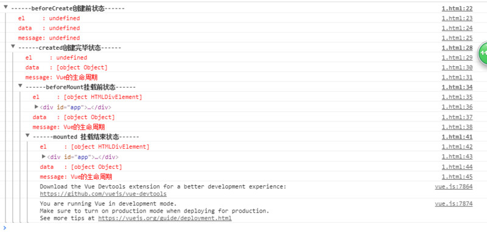

### vue生命周期每一步做了些什么
（譬如，data渲染，el渲染，什么时候可以获取到）  


* beforeCreate
* created
* beforeMount
* mounted
* beforeUpdate
* updated
* beforeDestroy
* destroyed


```javascript
<!DOCTYPE html>
<html lang="en">
<head>
  <meta charset="UTF-8">
  <meta name="viewport" content="width=device-width, initial-scale=1.0">
  <meta http-equiv="X-UA-Compatible" content="ie=edge">
  <title>vue生命周期学习</title>
  <script src="https://cdn.bootcss.com/vue/2.4.2/vue.js"></script>
</head>
<body>
  <div id="app">
    <h1>{{message}}</h1>
  </div>
</body>
<script>
  var vm = new Vue({
    el: '#app',
    data: {
      message: 'Vue的生命周期'
    },
    beforeCreate: function() {
      console.group('------beforeCreate创建前状态------');
      console.log("%c%s", "color:red" , "el     : " + this.$el); //undefined
      console.log("%c%s", "color:red","data   : " + this.$data); //undefined 
      console.log("%c%s", "color:red","message: " + this.message) 
    },
    created: function() {
      console.group('------created创建完毕状态------');
      console.log("%c%s", "color:red","el     : " + this.$el); //undefined
      console.log("%c%s", "color:red","data   : " + this.$data); //已被初始化 
      console.log("%c%s", "color:red","message: " + this.message); //已被初始化
    },
    beforeMount: function() {
      console.group('------beforeMount挂载前状态------');
      console.log("%c%s", "color:red","el     : " + (this.$el)); //已被初始化
      console.log(this.$el);
      console.log("%c%s", "color:red","data   : " + this.$data); //已被初始化  
      console.log("%c%s", "color:red","message: " + this.message); //已被初始化  
    },
    mounted: function() {
      console.group('------mounted 挂载结束状态------');
      console.log("%c%s", "color:red","el     : " + this.$el); //已被初始化
      console.log(this.$el);    
      console.log("%c%s", "color:red","data   : " + this.$data); //已被初始化
      console.log("%c%s", "color:red","message: " + this.message); //已被初始化 
    },
    beforeUpdate: function () {
      console.group('beforeUpdate 更新前状态===============》');
      console.log("%c%s", "color:red","el     : " + this.$el);
      console.log(this.$el);   
      console.log("%c%s", "color:red","data   : " + this.$data); 
      console.log("%c%s", "color:red","message: " + this.message); 
    },
    updated: function () {
      console.group('updated 更新完成状态===============》');
      console.log("%c%s", "color:red","el     : " + this.$el);
      console.log(this.$el); 
      console.log("%c%s", "color:red","data   : " + this.$data); 
      console.log("%c%s", "color:red","message: " + this.message); 
    },
    beforeDestroy: function () {
      console.group('beforeDestroy 销毁前状态===============》');
      console.log("%c%s", "color:red","el     : " + this.$el);
      console.log(this.$el);    
      console.log("%c%s", "color:red","data   : " + this.$data); 
      console.log("%c%s", "color:red","message: " + this.message); 
    },
    destroyed: function () {
      console.group('destroyed 销毁完成状态===============》');
      console.log("%c%s", "color:red","el     : " + this.$el);
      console.log(this.$el);  
      console.log("%c%s", "color:red","data   : " + this.$data); 
      console.log("%c%s", "color:red","message: " + this.message)
    }
  })
</script>
</html>
```

  


#### 如果没有了挂载元素 el:#app 会发生什么？


#### 如果同时存在template 和 el 会发生什么？


####  除了这几种，还有什么生命周期   


activited	keep-alive专属，组件被激活时调用
deadctivated	keep-alive专属，组件被销毁时调用


