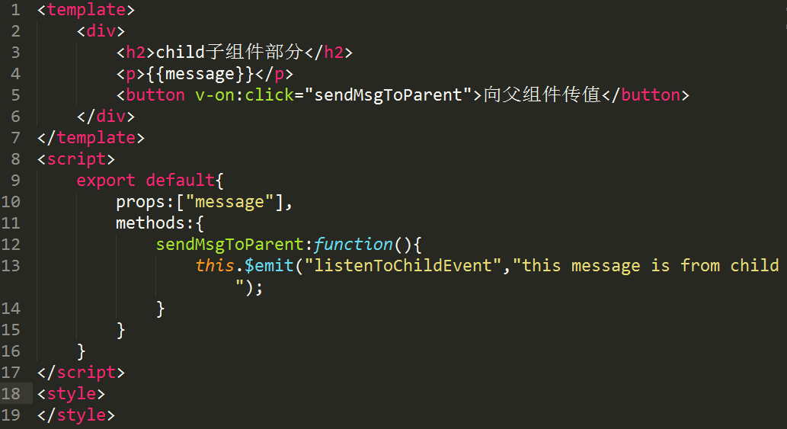
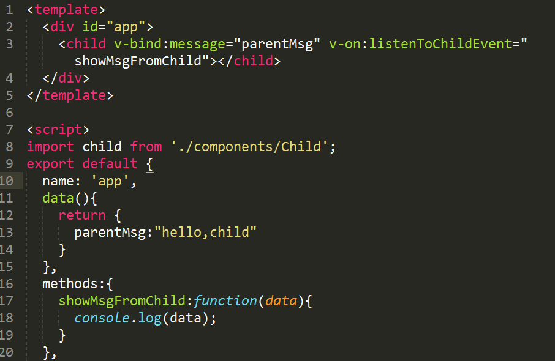
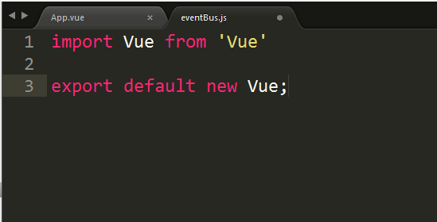
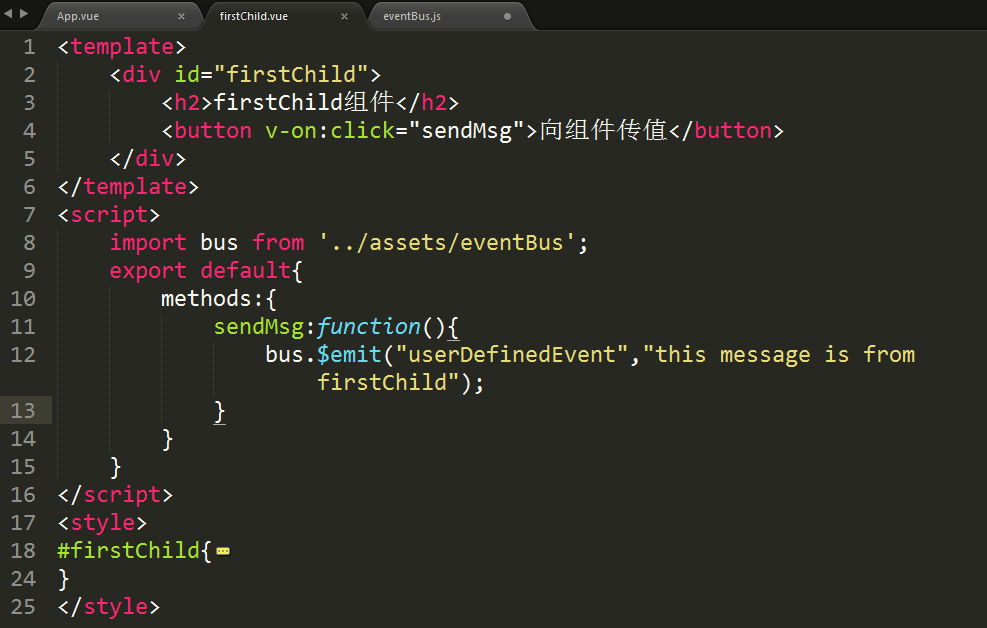

###  组件之间存在几种通信方式


#### props 父子组件通信
> 父组件  props
> 子组件 emit发送message

  
  


#### 利用总线方式可以平级组件进行通信 eventBus

1.建一个中间js




2.建第一个子组件




3.建第二个子组件


4.建父组件


* 创建一个事件总线，例如demo中的eventBus，用它作为通信桥梁
* 在需要传值的组件中用bus.$emit触发一个自定义事件，并传递参数
* 在需要接收数据的组件中用bus.$on监听自定义事件，并在回调函数中处理传递过来的参数


#### vue高级组件之provide / inject 2.2出

provide / inject 是 2.2 新增的方法，可以以一个祖先组件向所有子孙后代注入依赖（一个内容）。

provider/inject：简单的来说就是在父组件中通过provider来提供变量，然后在子组件中通过inject来注入变量。


1.父组件
```javascript

<template>
<div class="test">
<son prop="data"></son>
</div>
</template>

<script>
export default {
name: 'Test',
provide: {
name: 'Garrett'
}
}

```

2.孙子组件，不是子组件，是孙子，是孙子，是孙子

##### 父组件-子组件-孙子组件


```javascript
<template>
<div>
{{name}}
</div>
</template>

<script>
export default {
name: 'Grandson',
inject: [name]
}
</script>

```


####  vuex ,这个之后再讲，另起一篇


